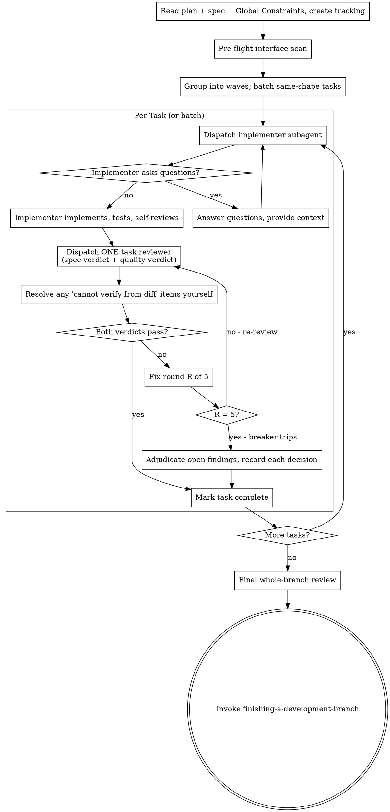

# Subagent-Driven Development

Execute a plan with fresh subagents per task and strict review gates.

## Required Start

Announce: `I'm using subagent-driven-development to execute this plan.`

## Core Flow



1. Read the plan once and extract all tasks. Note its **Global Constraints** block and its **Spec:** pointer — if the plan names a spec, read that too. The spec is the authority the plan argues from, so conflicts inside the plan resolve against it. A plan with no reachable spec is workable, but any judgment call you make without one is provisional — say so when you report.
2. Create task tracking for all tasks.
3. **Pre-flight interface scan.** Before dispatching Task 1, check the plan's Interfaces blocks against each other: for every task whose `Consumes` list names something, confirm an earlier task's `Produces` list defines it with the same name and shape. Mismatches found here cost one edit to the plan; the same mismatch found mid-run costs a failed task, a fix round, and a re-review. Raise everything you find in one pass rather than stumbling into it task by task. A plan whose tasks share no interfaces needs no scan — say so and move on.
4. Group tasks into waves, and batch same-shape tasks (see *Batching Same-Shape Tasks* below).
5. For each task or batch:
- Run `bash scripts/task-brief PLAN_FILE N` and dispatch the implementer with the **brief path** it prints — not the pasted task text (see *Handing Work Over as Files*).
- Resolve implementer questions before coding.
- Require implementer verification evidence.
- Run `bash scripts/review-package PLAN_FILE BASE HEAD`, then dispatch **one** task review with the package path — both a spec verdict and a quality verdict (see *Task Review* below).
- Resolve any "cannot verify from diff" items yourself before marking complete.
- If either verdict fails, run a fix round and re-review. Five rounds maximum.
- Mark task complete: update the task's checkbox in plan.md from `- [ ]` to `- [x]`. If `state.md` exists with a plan status section, update it to reflect the completed task.
   - For complex or high-risk tasks, validate the approach against requirements and consider simpler alternatives before or after the implementer's work.
   - For tasks centered on frontend/UI, apply `frontend-design` standards to guide structure, styling, and accessibility.
6. Run final whole-branch review on the most capable model available: `bash scripts/review-package PLAN_FILE $(git merge-base origin/main HEAD) HEAD`, then dispatch `requesting-code-review` with that package path and the plan's **Review Focus** section verbatim. Name the model explicitly — an omitted model silently inherits the session's.
7. Invoke `finishing-a-development-branch`.

## Parallel Waves (default for independent tasks)

When tasks are independent and touch disjoint files, dispatch them as a wave — this is the preferred mode, not a special case. Sequential execution is the fallback for dependent tasks, not the default.

**Decision rule:** Before starting execution, group tasks into waves based on file overlap and state dependencies. Tasks with no shared files and no sequential dependency belong in the same wave.

1. Build a wave of independent tasks.
2. Dispatch all implementers in a **single message** with multiple parallel Agent tool calls. Do not stagger across multiple messages.
3. Review each task with the same single-reviewer gate (both verdicts required).
4. Run integration verification after the wave completes.
5. Update all completed task checkboxes in plan.md (`- [ ]` → `- [x]`) and sync state.md if present.
6. Proceed to the next wave.

If any overlap or shared-state risk exists within a wave, move the conflicting task to the next sequential wave.

**Why single-message dispatch matters for cost:** All subagents share the same cached system prompt prefix. Dispatching them simultaneously in one message means every agent gets a cache hit on that prefix and only pays for its small unique task prompt. Staggered dispatch provides no additional benefit and wastes wall-clock time.

## Batching Same-Shape Tasks

When the plan lists several tasks that are each a small, independent edit **of the same kind** — the same one-line fix, the same constant change, the same field added across several files — do not dispatch one subagent per task.

Compose **one** brief listing every file and its change, dispatch it to a single subagent, and review the resulting diff as one unit.

**Batch when all of these hold:**
- Each task is mechanical: the change is already specified, no design judgment needed.
- The tasks touch disjoint files, or the same file in non-overlapping ways.
- One reviewer reading one diff could reject any individual change without ambiguity.

**Do not batch** work that needs its own judgment, its own tests, or its own review surface. A task that earns a real test cycle earns its own dispatch.

Batching is distinct from a parallel wave: a wave runs N subagents at once, a batch runs **one** subagent doing N small things. For micro-task plans the batch is dramatically cheaper — N dispatches each rebuild the same context from zero. When a batch review finds a problem, verify every file named in the brief actually appears in the diff before accepting it; a batched implementer that silently skips one file is the batch's characteristic failure.

## Task Review

**One reviewer per task, two mandatory verdicts.** A single reviewer reads the task's diff once and returns both:

- **Spec verdict** — does the implementation match the task's requirements? Missing scope and extra scope both count.
- **Quality verdict** — correctness, tests, error handling, and maintainability. Maintainability is reported, not enforced: structural preferences are capped at Minor and never gate a task.

Both are required. A review returning only one verdict is incomplete — send it back. Two separate reviewers were previously dispatched here; they read the same diff and the same task text, rebuilt the same context twice, and split findings across two fix round-trips that one reviewer surfaces in one. The reviewer template's Spec Alignment section already covers what the separate spec reviewer was asked to do.

**The third verdict: "cannot verify from diff."** Some requirements live in code the task did not touch, or span several tasks. The reviewer lists these rather than guessing. They do not block the review, but **you** resolve each one before marking the task complete — you hold the plan and the cross-task context the reviewer lacks. A "cannot verify" item you confirm as a real gap becomes a failed spec verdict and enters the fix loop with everything else.

**Never coach the reviewer.** Do not tell it to ignore a finding, skip an area, or treat something as "Minor at most." If you believe a finding would be a false positive, let it be raised and resolve it in the fix loop. If the prompt you are writing contains "do not flag", "don't treat X as a defect", or "the plan chose this" — stop. You are pre-judging to spare yourself a review round.

**Hand the reviewer its diff as a file.** Run `bash scripts/review-package PLAN_FILE BASE HEAD` and pass the path it prints. The reviewer then makes one Read call instead of composing three git commands, and the script has already refused the two ranges that cannot mean what they claim — empty, and spanning a branch point. Never dispatch a reviewer without a package.

Template: `./task-reviewer-prompt.md`

## Fix Loop and Circuit Breaker

A fix round is one fix dispatch plus one re-review. **Five rounds maximum per task.**

- **Rounds 1–3:** send the open findings to the implementer that did the work. Its context is intact — it knows the task, the code, and its own choices.
- **Rounds 4–5:** dispatch a fresh implementer on a more capable model, telling it plainly that prior attempts failed and what was tried. A loop surviving three rounds usually means the implementer cannot see its own problem; fresh eyes plus a capability bump in one move.
- **Minor findings never enter the loop.** Record them and pass the list to the final whole-branch review to triage.
- **Findings that exceed the task's requirements never enter the loop**, at any severity. The loop makes a task meet its brief; it does not extend the brief. Record these in the plan's `## Deferred` section and continue.

**When round 5 still leaves findings open, stop dispatching** and decide each one yourself:

- **Reviewer is wrong, or the point is contestable** → record the finding and why the code stands.
- **Real, but nothing downstream builds on it** → record it as real and deferred.
- **Real and load-bearing** (a later task builds on it, or it exposes a plan defect) → decide the smallest change that unblocks the dependent work, record it, and carry it into the next task's dispatch. Leaving a structural failure unrecorded lets every dependent task build on it.

Adjudicate **only** at the cap. Adjudicating early to end a loop is pre-judging under another name. Every adjudication gets written down — a silent discard is forbidden. Surface all of them in your final report: these are decisions you took on the user's behalf, and the report is the only place they see them.

## E2E Process Hygiene

When dispatching subagents that start background services (servers, databases, queues):

Subagents are stateless — they do not know about processes started by previous subagents. Accumulated background processes cause port conflicts, stale responses, and false test results.

Include in the subagent prompt for any E2E or service-dependent task:

**Unix/macOS:**
```
Before starting any service:
1. Kill existing instances: pkill -f "<service-pattern>" 2>/dev/null || true
2. Verify the port is free: lsof -i :<port> && echo "ERROR: port still in use" || echo "Port free"

After tests complete:
1. Kill the service you started.
2. Verify cleanup: pgrep -f "<service-pattern>" && echo "WARNING: still running" || echo "Cleanup verified"
```

**Windows:**
```
Before starting any service:
1. Kill existing instances: taskkill /F /IM "<process-name>" 2>nul || echo "No existing process"
2. Verify the port is free: netstat -ano | findstr :<port> && echo "ERROR: port still in use" || echo "Port free"

After tests complete:
1. Kill the service you started.
2. Verify cleanup: tasklist | findstr "<process-name>" && echo "WARNING: still running" || echo "Cleanup verified"
```

Exception: persistent dev servers the user explicitly keeps running — document them in `state.md`.

## Handling Implementer Status

Implementer subagents report one of four statuses. Handle each appropriately:

**DONE:** Proceed to spec compliance review.

**DONE_WITH_CONCERNS:** The implementer completed the work but flagged doubts. Read the concerns before proceeding. If the concerns are about correctness or scope, address them before review. If they're observations (e.g., "this file is getting large"), note them and proceed to review.

**NEEDS_CONTEXT:** The implementer needs information that wasn't provided. Provide the missing context and re-dispatch.

**BLOCKED:** The implementer cannot complete the task. Assess the blocker:
1. If it's a context problem, provide more context and re-dispatch with the same model.
2. If the task requires more reasoning, re-dispatch with a more capable model.
3. If the task is too large, break it into smaller pieces.
4. If the plan itself is wrong, escalate to the user.
5. If the user is unavailable and the task is non-critical: document the block in `state.md` and advance to the next independent task.

**Never** ignore an escalation or force the same model to retry without changes. If the implementer said it's stuck, something needs to change. Never silently skip or mark a blocked task complete.

## Hard Rules

- Do not execute implementation on `main`/`master` without explicit user permission.
- Do not skip the task review, and never accept a report missing either verdict — spec compliance AND quality are both required. An implementer's own self-review never replaces it.
- Do not accept unresolved review findings, except findings explicitly adjudicated at the five-round cap.
- Never make a subagent read the whole plan file. Hand it the brief for its task — that is what `scripts/task-brief` is for.
- Do not paste task text or implementer reports into dispatch prompts. Pass paths.
- Do not fix review findings yourself in the controller session — your context stays clean for coordination, and a controller fix skips review entirely.

## Context Isolation

Never forward parent session context or history to subagents. Construct each subagent's prompt from scratch using only:
- Task text
- Acceptance criteria
- Needed file paths
- Relevant constraints

Exclude unrelated prior assistant analysis and old failed hypotheses. Subagents must not receive conversation history, prior reasoning chains, or context from other subagent runs.

**Why this is also the cache-optimal approach:** All subagents share the same system prompt prefix, which the API caches. Keeping each subagent's input as `[cached system prompt] + [small unique task prompt]` means every agent hits the cache for the heavy shared prefix and only pays full input token price for its small task-specific tail. Forwarding parent conversation history would make each subagent's prefix unique, breaking cache sharing and multiplying input costs across the wave.

Note what that argument does **not** license: the cached part is the system prefix, and the unique tail is uncached either way. Pasting a task's full text into the prompt makes that tail *bigger*, so the same reasoning that bans forwarding history also argues for passing a path instead of a paste. A brief path is the smallest possible tail.

## Handing Work Over as Files

Everything you paste into a dispatch prompt, and everything a subagent prints back, stays in your context for the rest of the session and is re-read on every later turn. Hand artifacts over as files.

The controller has already read the plan. Pasting a task into a dispatch puts a **second** copy in your context, and an inline report puts a third block beside it. Measured against a real 18-task plan in this repo: ~605 tokens per task pasted versus ~75 passed as paths — about 9,500 tokens of permanent, repeatedly re-read context across the run.

**Per task:**

1. `bash scripts/task-brief PLAN_FILE N` — writes a self-contained brief (plan identity, Spec pointer, Global Constraints, the task body) and prints its path. The task id matches exactly: `3` never matches `Task 3.1` or `Task 10`.
2. Dispatch with the brief path, introduced as *"read this first — it is your requirements, with the exact values to use verbatim."*
3. Name the report file after the brief — `task-N-brief.md` → `task-N-report.md`, in the same directory — and put that path in the dispatch. The implementer writes its full report there and returns only status, commits, a one-line test summary, and concerns.
4. Give the reviewer the same brief path, the report path, and the review package from `bash scripts/review-package PLAN_FILE BASE HEAD`.

Exact values — numbers, magic strings, signatures, test cases — live in the brief and nowhere else. A dispatch prompt describes one task; it never carries the session's history. Do not paste "state after Tasks 1–3" summaries into later dispatches: a fresh subagent needs its brief, the interfaces it touches, and the global constraints. Nothing else.

The workspace lives at `<repo-root>/.superpowers/sdd/<plan-name>/` and ignores itself, so briefs and reports never reach a commit. It is scratch: `git clean -fdx` will delete it, and `git log` is the durable record. Each plan owns its own directory — another plan's directory is never yours to read or write.

## Subagent Containment

Two separate leaks, one instruction block. Every subagent prompt MUST carry both.

**Skill leakage.** Subagents can discover superpowers-optimized skills via filesystem access and invoke them, turning a focused implementer into a workflow orchestrator.

**Dispatch leakage.** A subagent that spawns its own subagents is spending your budget without your knowledge. The common case is an implementer dispatching a reviewer "to be safe" — which duplicates the task review you dispatch anyway, at a full extra review seat per task, and whose verdict counts for nothing because you never see it. A reviewer spawning a second reviewer for a "second opinion" is the same defect. Review arrives from the controller, after the report.

Every subagent prompt MUST include this instruction:

> You are a focused subagent. Do NOT invoke any skills from the superpowers-optimized plugin. Do NOT use the Skill tool. Do NOT dispatch, spawn, or delegate to any subagent of your own — not helpers, not reviewers, not a second opinion. Do all of this work yourself. If the job feels too large for one pass, do it in several passes yourself and say so in your report. Your only job is the task described below.

An implementer or reviewer that spawned a subagent anyway is reporting a defect, not extra rigor — note it and do not count its nested verdict.

## Model Selection for Agent Tool Calls

Choose model based on task type when dispatching subagents via the Agent tool:

| Model | Use for |
|---|---|
| `haiku` | File reads, summarization, log scanning, patch verification — output is data, not decisions |
| `sonnet` | Default for all implementation tasks |
| `opus` | Architecture analysis, complex spec review, multi-system debugging, any task requiring reasoning across many constraints at once |

Apply via the `model` parameter in Agent tool calls. Default to `sonnet` when uncertain. Only upgrade to `opus` when the task is genuinely reasoning-heavy — not just large.

## Prompt Templates

Use:
- `./implementer-prompt.md` — per task or per batch
- `./task-reviewer-prompt.md` — one per task, returns both verdicts

## Scripts

- `bash scripts/task-brief PLAN_FILE TASK_ID` — writes the task's self-contained brief and prints its path. Exit 2 means no task with that id exists; it lists the ids it found. Never dispatch on a brief you did not get a path back for.
- `bash scripts/review-package PLAN_FILE BASE HEAD` — writes the commit list, stat, and full diff to one file and prints its path. **Exit 3 means the range is empty or BASE is not an ancestor of HEAD — do not review, and do not work around it.** An empty range hands a reviewer nothing and gets back "no issues found"; that is a review of nothing, and the task would be marked reviewed. Fix the range instead: BASE is the commit recorded before the implementer was dispatched, or `git merge-base origin/main HEAD` for the whole branch.

Invoke bundled scripts through their interpreter (`bash scripts/task-brief …`) rather than executing them directly. Some plugin packagers strip executable bits, and a direct call then fails with `Permission denied`.

## Determining the Review Range

Every review needs a base commit. Getting this wrong silently reviews the wrong thing.

- **Per-task review:** record `git rev-parse HEAD` *before* dispatching the implementer and use that as `BASE_SHA`. Never `HEAD~1` — a task that made several commits would have all but the last silently dropped from the diff.
- **Final whole-branch review:** use `git merge-base origin/main HEAD` (substitute your default branch). Never a bare `origin/main`: once main moves past your branch point, main's newer files show up in the diff as phantom deletions your branch never made, and the reviewer spends the review on them.
- If `origin/main` is not fetched or the repo has no remote, use `git merge-base main HEAD`.

## Integration

- Setup workspace first with `using-git-worktrees`.
- The task reviewer uses `./task-reviewer-prompt.md`; the final whole-branch review uses `requesting-code-review`.
- Finish with `finishing-a-development-branch`.
